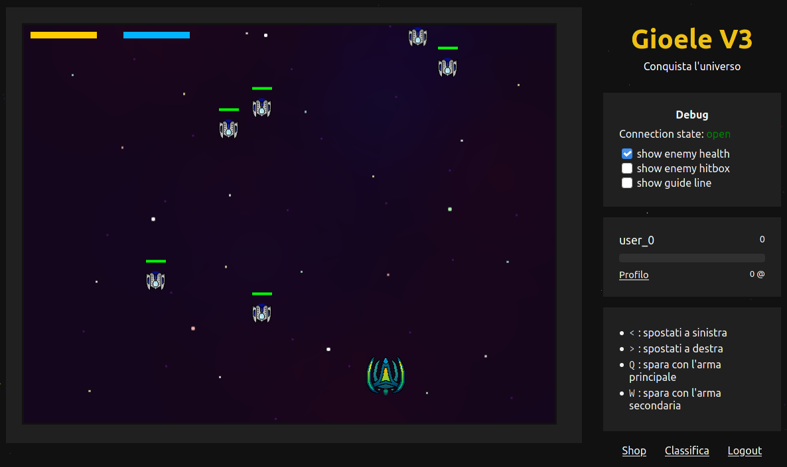

# Gioele-V3



Giovanni + Maurizio = Gioele V3

Enjoy.

### Installation

Required:

 - 
 - python 3.9+
 - 

```
~$ python3 -m venv env
~$ source env/bin/activate
(env) ~$ pip install -r requirements.txt
(env) ~$ python manage.py migrate
(env) ~$ python manage,py populatedb
```

To run (make sure redis is running):

```
(env) ~$ python manage,py runserver
```

by TronWeb, for IIS TronZanella.
